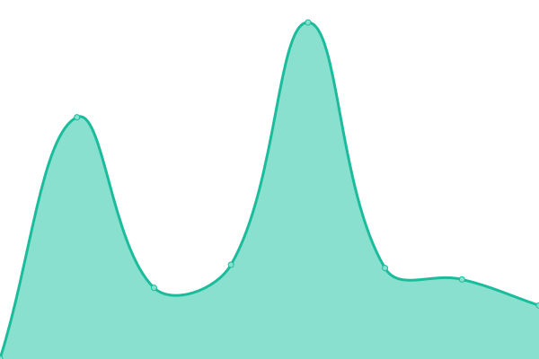

# [📈 Live Status](https://edzorrilla.github.io/uptime): <!--live status--> **🟩 All systems operational**

This repository contains the open-source uptime monitor and status page for [edzorrilla](https://edzorrilla.github.io/uptime), powered by [Upptime](https://github.com/upptime/upptime).

With [Upptime](https://upptime.js.org), you can get your own unlimited and free uptime monitor and status page, powered entirely by a GitHub repository. We use [Issues](https://github.com/edzorrilla/uptime/issues) as incident reports, [Actions](https://github.com/edzorrilla/uptime/actions) as uptime monitors, and [Pages](https://edzorrilla.github.io/uptime) for the status page.

<!--start: status pages-->
<!-- This summary is generated by Upptime (https://github.com/upptime/upptime) -->
<!-- Do not edit this manually, your changes will be overwritten -->
<!-- prettier-ignore -->
| URL | Status | History | Response Time | Uptime |
| --- | ------ | ------- | ------------- | ------ |
|  [VapeRanger](https://vaperanger.com) | 🟩 Up | [vape-ranger.yml](https://github.com/edzorrilla/uptime/commits/HEAD/history/vape-ranger.yml) | 

 270ms
     
 | 

<a href="https://edzorrilla.github.io/uptime/history/vape-ranger">100.00%</a>
    

|  [Hemmfy](https://www.hemmfy.com) | 🟩 Up | [hemmfy.yml](https://github.com/edzorrilla/uptime/commits/HEAD/history/hemmfy.yml) | 

 324ms
     
 | 

<a href="https://edzorrilla.github.io/uptime/history/hemmfy">100.00%</a>
    

|  [eJuiceDB](https://www.ejuicedb.com) | 🟩 Up | [e-juice-db.yml](https://github.com/edzorrilla/uptime/commits/HEAD/history/e-juice-db.yml) | 

 744ms
     
 | 

<a href="https://edzorrilla.github.io/uptime/history/e-juice-db">100.00%</a>
    

|  [Well Versed](https://staywellversed.com) | 🟩 Up | [well-versed.yml](https://github.com/edzorrilla/uptime/commits/HEAD/history/well-versed.yml) | 

 214ms
     
 | 

<a href="https://edzorrilla.github.io/uptime/history/well-versed">100.00%</a>
    

|  [Ads VapeRanger](https://ads.vaperanger.com) | 🟩 Up | [ads-vape-ranger.yml](https://github.com/edzorrilla/uptime/commits/HEAD/history/ads-vape-ranger.yml) | 

 338ms
     
 | 

<a href="https://edzorrilla.github.io/uptime/history/ads-vape-ranger">100.00%</a>
    

<!--end: status pages-->

[**Visit our status website →**](https://edzorrilla.github.io/uptime)

## 📄 License

- Powered by: [Upptime](https://github.com/upptime/upptime)
- Code: [MIT](./LICENSE) © [edzorrilla](https://edzorrilla.github.io/uptime)
- Data in the `./history` directory: [Open Database License](https://opendatacommons.org/licenses/odbl/1-0/)
